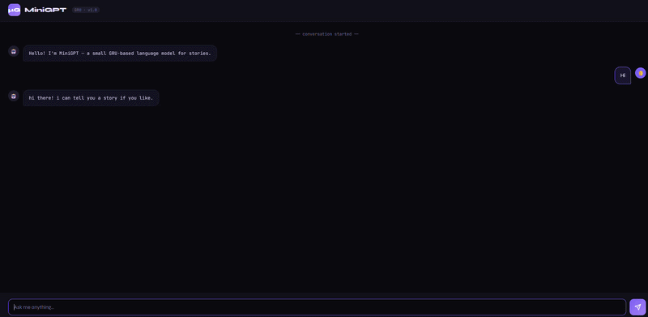

# Mini-Language-Model

Lightweight implementation of a small language model (similar to chatGPT) using GRU. We do pretraining over a story-telling dataset and post-training over a chat-template with synthetic data. 
## Demo



## Features

- **GRU-Based Language Model**: Efficient architecture optimized for CPU training with embedding, dropout, and layer normalization.
- **Pre-training**: Next-token prediction on text data for general language understanding.
- **Fine-tuning**: Specialized training on conversational pairs for chat capabilities.
- **Inference Engine**: Generate responses with configurable temperature and top-k sampling.
- **Web Interface**: Flask-based chat application with a simple HTML frontend.
- **CPU-Optimized**: Designed to run on standard laptops without requiring GPUs.

## Installation

1. Clone the repository:

    ```bash
    git clone <repository-url>
    cd small-scale-chatgpt
    ```

2. Create a virtual environment:

    ```bash
    python -m venv .venv
    # On Windows:
    .venv\Scripts\activate
    # On macOS/Linux:
    source .venv/bin/activate
    ```

3. Install dependencies:
    ```bash
    pip install -r requirements.txt
    ```

## Usage

### 1. Data Preparation

Prepare your vocabulary and training data:

```bash
python data_prep.py
```

### 2. Pre-training

Train the base language model on next-token prediction:

```bash
python pretrain.py
# Optional: specify epochs and steps per epoch
python pretrain.py --epochs 15 --steps_per_epoch 200
```

### 3. Fine-tuning

Fine-tune the model on conversational data:

```bash
python finetune.py
# Optional: specify epochs
python finetune.py --epochs 40
```

### 4. Inference (CLI)

Generate responses from the command line:

```bash
python inference.py --message "Hello, how are you?"
# Optional: adjust generation parameters
python inference.py --message "Tell me a story" --temperature 0.6 --top_k 20
```

### 5. Web Application

Run the Flask web app for interactive chat:

```bash
python app.py
```

Open http://localhost:5000 in your browser.

### Training All at Once

Run the complete training pipeline:

```bash
python train_all.py
```

## Development Notes

- **Pre-commit**

    We use pre-commit to automate linting of our codebase.
    - Install hooks:
        ```bash
        pre-commit install
        ```
    - Run Hooks manually (optional):
        ```bash
        pre-commit run --all-files
        ```

- **Ruff**:
    - Lint and format:
        ```bash
        ruff check --fix
        ruff format
        ```
